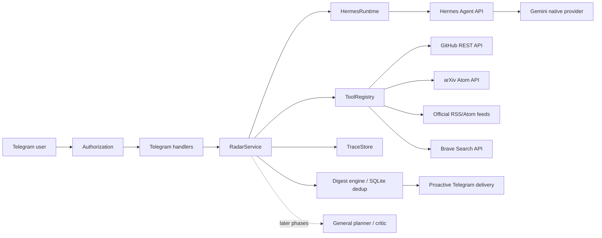

# Autonomous AI Research Radar

Autonomous AI Research Radar adalah fondasi sistem riset AI berbasis bukti,
bukan chatbot `prompt -> model -> jawaban`. Aplikasi menerima request dari
Telegram, menggunakan Hermes Agent sebagai runtime agentic, Gemini sebagai
provider model utama, dan menyediakan tool terpisah untuk GitHub, arXiv, serta
web search.

Status saat ini: **Phase 1–2 plus autonomous digest milestone**.

- Phase 1: konfigurasi, Gemini abstraction, Hermes runtime adapter, Telegram,
  retry, structured logging, dan execution traces.
- Phase 2: GitHub repository search/analyzer, arXiv search, Brave web search,
  normalisasi data, heuristic repository signals, dan tool registry.
- Digest terjadwal sekarang menggabungkan RSS gratis, GitHub publik, arXiv, dan
  Brave bila tersedia; melakukan ranking, deduplikasi SQLite, sintesis Gemini
  opsional, serta pengiriman Telegram proaktif.
- General-purpose planning, critic, persistent conversational research memory,
  evaluation, dan Docker production deployment berada pada fase berikutnya.

## Mengapa Hermes dan Gemini?

Hermes dipakai sebagai agent runtime karena menyediakan tool loop, session,
memory, skills, dan API integration resmi. Aplikasi mengakses Hermes melalui
HTTP agar dependency Hermes yang dipin ketat tetap terisolasi dan upgrade Hermes
tidak memaksa refactor business logic.

Gemini dipakai melalui SDK resmi `google-genai`. Semua direct LLM call milik
aplikasi melewati kontrak `LLMProvider`; panggilan model internal Hermes tetap
berada di belakang kontrak `HermesRuntime`.

## Arsitektur Saat Ini



Boundary utama:

- Telegram hanya mengurus authorization, command parsing, progress, formatting,
  dan safe error messages.
- `RadarService` mengoordinasikan runtime/tool dan execution trace.
- Setiap source tool mengembalikan Pydantic model, bukan HTML atau payload besar.
- Hermes berjalan sebagai proses terpisah dan hanya diakses melalui authenticated
  HTTP API.
- Tool tidak otomatis dipanggil semua. Command eksplisit memilih source yang
  relevan.

Dokumentasi lebih detail tersedia di:

- [Phase 1 plan](docs/phase-1-plan.md)
- [Current architecture](docs/architecture.md)
- [Tool system](docs/tool-system.md)
- [Hermes setup](docs/hermes-setup.md)
- [Phase 1–2 completion status](docs/phase-2-status.md)

## Struktur Proyek

```text
src/research_radar/
├── agent/              # HermesRuntime contract dan HTTP adapter
├── llm/                # LLMProvider, GeminiProvider, model router
├── observability/      # JSON logging dan execution traces
├── telegram/           # auth, handlers, formatter, bot builder
├── tools/              # GitHub, arXiv, Brave, registry
├── utils/              # bounded retry helper
├── bootstrap.py        # dependency assembly
├── config.py           # environment settings
├── schemas.py          # Pydantic contracts
├── service.py          # application orchestration
└── main.py             # CLI entry point
tests/
├── unit/               # no live API dependency
└── integration/        # opt-in live checks
scripts/smoke.py        # credential-aware smoke checks
```

## Fitur Phase 1–2

### Hermes Runtime

- Authenticated OpenAI-compatible HTTP request.
- Stable Telegram session key.
- Idempotency key per request.
- Bounded retries for timeout, network error, `429`, dan `5xx`.
- Health check.
- Fake runtime untuk unit tests.

### Gemini Provider

- Async `google-genai` client.
- Unstructured dan Pydantic structured output.
- Model selection per request.
- Token usage, provider response ID, dan latency.
- Timeout, bounded retry, invalid-output rejection, dan explicit cleanup.

### GitHub

- Repository search dengan created/pushed/language qualifier.
- Stars, forks, issues, language, topics, timestamps, license, dan size.
- Heuristic signals: recency, activity, popularity, estimated growth,
  relevance, dan technical depth.
- Repository analyzer mengambil metadata, README, latest release, dan recent
  commits secara concurrent.
- Partial failure tidak membatalkan seluruh analisis.
- README dipotong sesuai context budget; repository tidak pernah di-dump penuh.

Signal GitHub adalah heuristic ranking aids, bukan ukuran kualitas ilmiah.
`growth_score`, misalnya, mengaproksimasi star velocity berdasarkan usia repo dan
bukan historical star series.

### arXiv

- Atom API langsung tanpa scraping.
- Keyword, category, dan submitted-date filtering.
- Mendukung kategori `cs.AI`, `cs.LG`, `cs.CL`, `cs.CV`, `cs.SE`, `cs.IR`.
- Title, authors, abstract, categories, timestamps, abstract URL, dan PDF URL.
- Minimum request interval agar penggunaan API tetap sopan.

### Web Search

- Brave Search API dengan token pada header.
- Date range, country, language, safe search, dan batas maksimal 20 hasil.
- Snippet dibatasi; aplikasi tidak memperlakukan snippet sebagai bukti final.
- Source-quality heuristic memprioritaskan paper, repository, documentation,
  domain pendidikan/pemerintah, lalu sumber umum.

### Autonomous Digest

- Sumber gratis tetap berfungsi sebelum GitHub token atau Brave dikonfigurasi:
  public GitHub Search, arXiv API, dan RSS/Atom sumber teknologi.
- Default fokus pada AI agents, model/alat gratis dan open-source, local AI,
  CPU-only inference, serta teknologi efisien untuk laptop lama.
- Maksimal lima item per sumber, concurrency default tiga, dan proses diberi
  prioritas background rendah ketika dijalankan melalui systemd.
- SQLite hanya menyimpan URL yang sudah terkirim dan waktu digest, bukan isi
  percakapan atau credential.
- Bila Gemini tersedia, setiap item berita, GitHub, dan arXiv mendapat analisis
  terstruktur: apa teknologinya, kegunaan, cara kerja, stack/komponen yang benar-benar
  didukung bukti, inti kontribusi, alasan penting, caveat, dan kualitas bukti.
- Analisis GitHub memakai metadata dan potongan README yang dibatasi; analisis paper
  memakai abstract, sedangkan berita berbasis snippet wajib menyatakan bila buktinya
  belum cukup. Tanpa Gemini, formatter tetap mengirim ringkasan sumber dan URL asli
  dengan label bahwa item belum dianalisis AI.

## Command Telegram

```text
/start
/help
/research <tujuan>
/trending [query]
/papers <query>
/repos <query>
/web <query>
/analyze <owner/repo atau URL GitHub>
/digest
/weekly
/status
/memory
/skills
```

Natural-language messages diteruskan ke Hermes. `/repos`, `/papers`, `/web`,
`/analyze`, dan `/digest` menggunakan adapter source aplikasi secara langsung.
`/weekly` sekarang menjadi alias `/digest`.

## Prasyarat

- Python 3.12 atau 3.13.
- Hermes Agent terpasang dan dikonfigurasi dengan provider Gemini.
- Telegram bot token dan numeric Telegram user ID.
- Gemini API key opsional untuk sintesis digest dan direct LLM calls.
- GitHub token opsional tetapi direkomendasikan untuk rate limit lebih tinggi.
- Brave Search API key hanya diperlukan untuk `/web`.

Hermes upstream saat ini membutuhkan Python `>=3.11,<3.14` dan sebaiknya
dipasang melalui installer resminya, terpisah dari virtual environment aplikasi.

## Instalasi Lokal

```bash
python3.12 -m venv .venv
source .venv/bin/activate
python -m pip install -e '.[dev]'
cp .env.example .env
```

Isi `.env` secara lokal. File tersebut diabaikan Git dan tidak boleh dikirim ke
repository.

## Konfigurasi Hermes

Instal dan siapkan Hermes sesuai dokumentasi resmi:

```bash
curl -fsSL https://hermes-agent.nousresearch.com/install.sh | bash
hermes model
```

Pilih Google AI Studio/Gemini. Di environment Hermes (umumnya
`~/.hermes/.env`) tambahkan:

```env
GOOGLE_API_KEY=...
API_SERVER_ENABLED=true
API_SERVER_KEY=generate-a-strong-local-secret
```

Kemudian jalankan:

```bash
hermes gateway run
```

API default tersedia di `http://127.0.0.1:8642/v1`. Gunakan nilai
`API_SERVER_KEY` yang sama sebagai `HERMES_API_KEY` pada `.env` aplikasi.

Jangan mengaktifkan Telegram gateway Hermes dengan token yang sama. Hanya bot
aplikasi ini yang boleh melakukan polling menggunakan `TELEGRAM_BOT_TOKEN`.

## Menjalankan Bot

```bash
source .venv/bin/activate
research-radar bot
```

Unknown Telegram users ditolak ketika allowlist kosong atau ID mereka tidak
tercantum pada `TELEGRAM_ALLOWED_USER_IDS`.

Jalankan satu digest tanpa mengirim untuk inspeksi:

```bash
research-radar digest --dry-run --force
```

Kirim digest dan catat hasil agar tidak dikirim ulang:

```bash
research-radar digest
```

Unit user systemd tersedia di [deploy/systemd](deploy/systemd/README.md). Timer
menjalankan digest dua menit setelah login dan setiap pukul 07.30 WIB; cooldown
12 jam mencegah pengiriman ganda bila dua jadwal berdekatan.

## Quality Gates

```bash
.venv/bin/ruff check .
.venv/bin/ruff format --check .
.venv/bin/mypy src
.venv/bin/pytest
```

Unit tests tidak menggunakan live network. Integration tests akan `skip` ketika
credential tidak tersedia:

```bash
RUN_LIVE_TESTS=1 .venv/bin/pytest -m live tests/integration
RUN_LIVE_TESTS=1 python scripts/smoke.py all
```

## Environment Variables

| Variable | Required | Purpose |
|---|---:|---|
| `GEMINI_API_KEY` | no | Sintesis digest/direct Gemini; digest dasar tetap berjalan |
| `GEMINI_MODEL` | yes | Default Gemini model ID |
| `GEMINI_FAST_MODEL` | no | Cheap/fast workload route |
| `GEMINI_REASONING_MODEL` | no | Reasoning workload route |
| `HERMES_API_URL` | yes | Hermes API base ending in `/v1` |
| `HERMES_API_KEY` | yes | Hermes API bearer token |
| `HERMES_MODEL_NAME` | no | Model advertised by Hermes API |
| `TELEGRAM_BOT_TOKEN` | yes | Bot token from BotFather |
| `TELEGRAM_ALLOWED_USER_IDS` | yes | Comma-separated numeric IDs |
| `GITHUB_TOKEN` | no | Higher GitHub API limits |
| `BRAVE_SEARCH_API_KEY` | for `/web` | Brave subscription token |
| `MAX_RETRIES` | no | Bounded attempts, default 3 |
| `MAX_CONCURRENCY` | no | Per-source bound, default 3 |
| `DIGEST_TOPICS` | no | Daftar fokus dipisahkan koma |
| `DIGEST_SEARCH_QUERIES` | no | Query pendek GitHub/arXiv dipisahkan koma |
| `DIGEST_ITEMS_PER_SOURCE` | no | Maksimum temuan tiap kategori, default 5 |
| `DIGEST_MIN_INTERVAL_HOURS` | no | Cooldown pengiriman, default 12 jam |
| `DIGEST_STATE_PATH` | no | Lokasi SQLite deduplication state |
| `NEWS_FEED_URLS` | no | RSS/Atom gratis, dipisahkan koma |

See [.env.example](.env.example) for the complete list and defaults.

## Observability dan Cost

Phase 1–2 mencatat task status, duration, runtime/LLM/tool calls, token count yang
tersedia, retry, dan error type. Logs dirender sebagai JSON dan common secret
shapes di-redact. `/status` menampilkan metrik proses saat ini.

Estimated price belum ditampilkan karena harga model berubah dan Hermes belum
direkonsiliasi dengan direct Gemini calls. Fitur tersebut baru akan diaktifkan
setelah pricing table terversi dan token usage Hermes dapat diverifikasi; sistem
tidak akan menyebut angka estimasi sebagai biaya pasti.

## Context Optimization

Repository analyzer menerapkan progressive disclosure tahap awal:

```text
metadata -> README terbatas -> release -> recent commits
```

README default dibatasi 12.000 karakter. File tree dan source file retrieval baru
akan ditambahkan ketika planner/ranking Phase 3 dapat menentukan relevansinya.

## Security

- Tidak ada default allow-all untuk Telegram.
- Secret menggunakan `SecretStr` dan `.env` tidak di-commit.
- Hermes API harus bind ke loopback/private network dan memakai bearer token.
- Raw stack trace tidak dikirim ke Telegram.
- Search query divalidasi dan output Telegram di-escape.
- GitHub dan arXiv public data dapat berjalan tanpa user credential; web search
  dinonaktifkan bila API key tidak ada.

## Docker Deployment

Belum disediakan pada Phase 2. Hermes menggunakan managed installation dan
dependency pins sendiri; image/Compose akan dibuat pada production-hardening
phase setelah local vertical slice dan research pipeline stabil. Jangan mengira
folder ini siap production hanya karena unit tests lulus.

## Screenshot

Placeholder sampai live Telegram credentials tersedia:

```text
[ Telegram /repos result screenshot ]
[ Telegram /papers result screenshot ]
[ Telegram /analyze partial-result screenshot ]
```

## Limitations

- Pipeline lintas sumber baru tersedia untuk digest; natural-language research
  turn belum memakai planner general-purpose yang sama.
- Belum ada critic atau citation checker yang membuka dan memverifikasi isi penuh
  setiap artikel; RSS dan Brave tetap discovery evidence.
- SQLite saat ini hanya untuk deduplikasi digest, belum persistent research
  memory lengkap.
- `/memory` dan `/skills` masih meminta Hermes menjalankan turn.
- Live Gemini/Hermes/Telegram behavior memerlukan credential operator.
- GitHub growth score masih merupakan heuristic, bukan historical measurement.

## Roadmap

1. Phase 3: perluas pipeline digest menjadi intent parser dan tool routing untuk
   semua natural-language research turn.
2. Phase 4: researcher/critic/verification dan source-linked synthesis.
3. Phase 5: SQLAlchemy + SQLite memory dan compaction.
4. Phase 6: versioned Hermes research skills dan controlled improvement loop.
5. Phase 7: cache, context budgets, model routing, dan cost estimation.
6. Phase 8: evaluation dataset dan baseline-vs-optimized benchmark.
7. Phase 9: production scheduling hardening dan monitoring delivery.
8. Phase 10: Docker, health/readiness, graceful shutdown, dan hardening.

## Official Integration References

- Hermes: <https://hermes-agent.nousresearch.com/docs/>
- Hermes API server: <https://hermes-agent.nousresearch.com/docs/user-guide/features/api-server>
- Google Gen AI SDK: <https://googleapis.github.io/python-genai/>
- Telegram Bot API: <https://core.telegram.org/bots/api>
- GitHub REST API: <https://docs.github.com/en/rest>
- arXiv API: <https://info.arxiv.org/help/api/basics.html>
- Brave Search API: <https://api-dashboard.search.brave.com/app/documentation/web-search>
