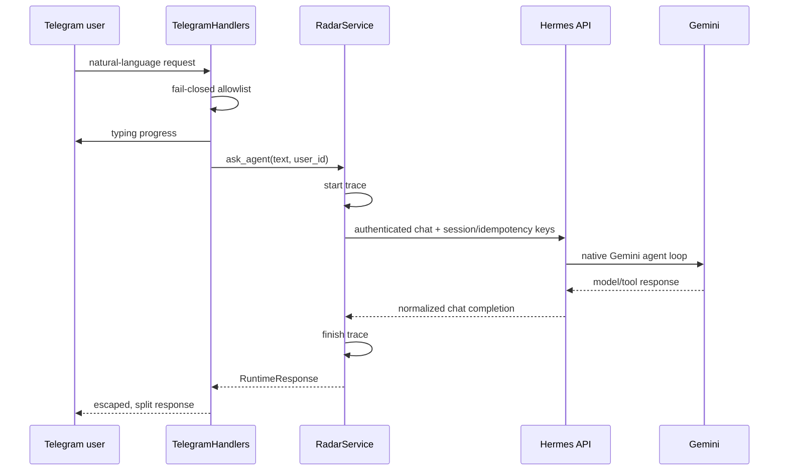

# Current Architecture (Phase 1–2 + Autonomous Digest)

> Current reliability update (2026-09-08): the application now has bounded research orchestration, consensus/verification, evidence persistence, and retrieval diagnostics. See the [hardening report](retrieval-hardening.md) for current contracts, tests and live measurements. Phase 1–2 descriptions below are historical.

## Decision

The application and Hermes Agent run as separate processes. The application
owns Telegram product behavior and normalized research tools; Hermes owns its
agent loop, internal tools, session context, memory, and skills.

Hermes is deliberately not imported into this package. Its supported library
workflow requires an editable upstream checkout and its stateful `AIAgent` is
not safe to share across concurrent tasks. The authenticated API boundary is
smaller, async-friendly, mockable, and independently upgradeable.

## Runtime Flow

Explicit source commands stop at the normalized tool result; they do not spend
LLM tokens. The application-owned digest concurrently collects bounded evidence
from GitHub, arXiv, RSS, and optional Brave; filters previously sent URLs with
SQLite; then uses optional Gemini synthesis before proactive Telegram delivery.
General natural-language turns still require a future planner to use that same
cross-source workflow.

## Trust Boundaries

- Telegram sender ID is untrusted until allowlist validation.
- Hermes HTTP is privileged because it may expose powerful tools. Keep it
  private, authenticate every request, and configure Hermes tool permissions.
- External API responses are untrusted and must pass Pydantic normalization.
- Search snippets are discovery aids, not final evidence.
- Logs must contain identifiers and error types, not raw tokens or response
  payloads.

## Ownership

| Concern | Owner |
|---|---|
| Telegram authorization/formatting | Application |
| Research source adapters | Application |
| Domain traces and later DB | Application |
| Agent loop and Hermes tools | Hermes |
| Conversation/procedural context | Hermes |
| Direct structured LLM calls | `LLMProvider` / Gemini |
| Gemini calls made by Hermes | Hermes native provider |
