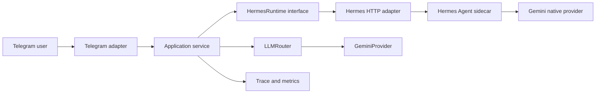

# Autonomous AI Research Radar — Assessment and Phase 1 Plan

Date assessed: 2026-08-27

## Current Repository Assessment

- The workspace is empty apart from read-only `.agents`, `.codex`, and `.git`
  placeholders.
- The directory is not currently a usable Git repository, so there is no commit
  history to preserve or inspect.
- There is no application code, README, dependency manifest, environment file,
  database, test suite, or container configuration.
- The host has Python 3.12.3 and Git 2.43.0.
- `uv`, Docker, and Docker Compose are not currently installed or available on
  `PATH`.
- No credentials were found or requested. Live Gemini, Hermes, and Telegram
  verification will remain pending until the operator supplies them locally.

## Current Ecosystem Findings

### Hermes Agent

- The current upstream project is NousResearch/hermes-agent. The inspected
  upstream `pyproject.toml` reports version `0.20.6` and Python
  `>=3.11,<3.14`.
- Hermes supports a native Gemini provider, persistent sessions/memory, skills,
  a messaging gateway, cron, and an authenticated OpenAI-compatible HTTP API.
- Hermes' supported Python-library workflow requires running from an editable
  checkout; it does not publish a supported wheel for ordinary dependency
  installation.
- Hermes pins its own dependencies tightly and its `AIAgent` object is stateful
  and not safe to share between concurrent tasks.
- The official HTTP integration offers the cleanest upgrade boundary for this
  project. It prevents Hermes' dependency pins and process state from leaking
  into the application.

Official references:

- <https://hermes-agent.nousresearch.com/docs/>
- <https://hermes-agent.nousresearch.com/docs/guides/python-library>
- <https://hermes-agent.nousresearch.com/docs/developer-guide/programmatic-integration>
- <https://hermes-agent.nousresearch.com/docs/user-guide/features/api-server>
- <https://hermes-agent.nousresearch.com/docs/guides/google-gemini>

### Gemini

- Use the current `google-genai` SDK (`from google import genai`), not the
  deprecated legacy SDK.
- The SDK provides an async client, Pydantic/JSON-schema structured output,
  response IDs, token usage metadata, timeout configuration, and explicit
  client cleanup.
- Model IDs will be configuration values. Startup/live diagnostics must validate
  availability instead of assuming a preview model is available in every
  account or region.

Official references:

- <https://googleapis.github.io/python-genai/>
- <https://ai.google.dev/gemini-api/docs/structured-output>

### Telegram

- Use `python-telegram-bot` 22.x, whose current stable documentation is 22.8.
  It is async-first and supports Python 3.10+.
- The application will use long polling for local development. Webhooks are a
  later deployment option; Telegram does not allow polling and webhook delivery
  for the same bot at the same time.
- A Telegram bot token may not be used by both the custom application and the
  native Hermes Telegram gateway concurrently. The Hermes sidecar's Telegram
  adapter will therefore remain disabled.
- Authorization is fail-closed via an explicit numeric user-ID allowlist.

Official references:

- <https://docs.python-telegram-bot.org/en/stable/>
- <https://core.telegram.org/bots/api>

## Architecture Proposal



The application owns product behavior: authorization, commands, request
validation, progress/failure messages, later research planning, evidence,
ranking, reports, persistence, and evaluation. Hermes owns the agent loop,
tool execution, skills, and its internal session context. Direct application LLM
calls go only through `LLMProvider -> GeminiProvider`; Hermes-owned model calls
remain encapsulated behind `HermesRuntime`.

The recommended Phase 1 request path is:

```text
Telegram update
-> authorization
-> application service
-> HermesRuntime HTTP request
-> Hermes agent loop using its configured native Gemini provider
-> normalized application response
-> safe Telegram formatter/splitter
-> Telegram reply
```

This deliberately does not build research tools yet. Phase 1 proves the vertical
slice and establishes seams that can be replaced with fakes in tests.

### Proposed Phase 1 Layout

```text
src/research_radar/
├── agent/
│   ├── base.py
│   └── hermes_runtime.py
├── llm/
│   ├── base.py
│   ├── gemini.py
│   └── router.py
├── observability/
│   ├── logging.py
│   └── tracing.py
├── telegram/
│   ├── authorization.py
│   ├── bot.py
│   ├── formatter.py
│   └── handlers.py
├── config.py
├── main.py
└── schemas.py
tests/unit/
tests/integration/
scripts/
```

## Dependency Proposal

The application will target Python 3.12 and use a `pyproject.toml` plus lockfile.
Compatible release ranges will be declared in the manifest; the lockfile will
record the exact tested resolution.

Runtime dependencies:

- `google-genai` — supported Gemini Developer API client.
- `python-telegram-bot>=22,<23` — asynchronous Telegram adapter.
- `httpx>=0.28,<0.29` — Hermes HTTP transport and future research tools.
- `pydantic>=2,<3` and `pydantic-settings>=2,<3` — schemas and fail-fast env
  configuration.
- `tenacity>=9,<10` — bounded retry policies.
- Python standard `logging` with a dedicated JSON formatter — structured logs
  without another runtime dependency; secret-shaped fields are redacted.

Development dependencies:

- `pytest`, `pytest-asyncio`, `pytest-cov`, `respx` — isolated async tests and
  HTTP mocks.
- `ruff` — formatting and linting.
- `mypy` — static type checks.

Hermes will not be placed in the application dependency graph. It will run from
an official, version-pinned installation/checkout in a separate process and be
reached through its authenticated API server. Docker packaging comes in the
production-hardening phase, but its interface is defined now.

## Risk Assessment

| Risk | Impact | Mitigation |
|---|---|---|
| Hermes is fast-moving and has no supported wheel | In-process imports break or conflict | Isolate it behind an HTTP adapter; pin/test a Hermes release; expose a fake runtime |
| Two Telegram consumers use one bot token | Polling conflicts and missing updates | Only the application polls; keep Hermes' Telegram adapter disabled |
| Hermes API exposes powerful tools | Remote command/file access if leaked | Bind loopback/private network, require a strong bearer key, restrict toolsets and workspace |
| Gemini model aliases/previews change | Startup or live requests fail | Require model IDs via env and add a credential/model smoke check |
| Gemini quota/rate limits | Partial or failed replies | Timeouts, bounded exponential retry, friendly errors, request IDs, and later caching/model routing |
| Sync/stateful Hermes internals block async bot | Event-loop stalls and state races | Use the external async HTTP boundary; never share embedded `AIAgent` objects |
| Metrics differ between direct Gemini and Hermes | Incomplete token/cost totals | Record app-boundary traces now; add Hermes usage reconciliation before claiming exact cost |
| Duplicate memory between app and Hermes | Drift and privacy ambiguity | Hermes stores conversational/procedural context; application DB later stores research-domain records |
| Credentials unavailable during development | Cannot prove live end-to-end behavior | Unit/mock tests plus opt-in integration smoke tests; label live verification pending |
| Docker and uv absent locally | Tooling commands cannot run immediately | Bootstrap `uv` only after approval; verify locally without Docker in Phase 1 |

## Overall Implementation Plan

1. Phase 1 — foundation and live vertical slice.
2. Phase 2 — independent GitHub, arXiv, and web tools with normalized schemas.
3. Phase 3 — planner, selective routing, bounded parallel research,
   deduplication, and ranking.
4. Phase 4 — evidence-linked analysis, critic, verification, and report synthesis.
5. Phase 5 — SQLAlchemy/SQLite research memory and compaction.
6. Phase 6 — versioned Hermes skills and validated learning workflow.
7. Phase 7 — cache, context budgets, model routing, and full cost/latency metrics.
8. Phase 8 — evaluation dataset, offline eval runner, and baseline-vs-optimized
   benchmark.
9. Phase 9 — weekly scheduling through the same application service.
10. Phase 10 — Docker, health/readiness checks, graceful shutdown, security
    hardening, and complete documentation.

Every phase ends with unit tests, static checks, relevant mocked integration
tests, updated docs, and an explicit list of live checks that credentials or
external services prevented.

## Phase 1 Task List

1. Initialize the Python 3.12 project manifest, source layout, `.gitignore`,
   `.env.example`, and a focused README.
2. Implement strict settings with secret-safe representations and validation for
   Gemini, Hermes API, Telegram token, and numeric Telegram allowlist.
3. Implement `LLMProvider`, `GeminiProvider`, typed response/usage objects,
   async cleanup, bounded retries, timeout, request IDs, and structured-output
   support.
4. Implement `HermesRuntime` plus an authenticated async HTTP adapter and fake
   test implementation. No Hermes internal imports.
5. Implement async Telegram handlers for `/start`, `/help`, `/status`, and
   natural-language messages; reserve unsupported research commands with honest
   Phase 2 messages.
6. Implement fail-closed authorization, safe exception mapping, HTML escaping,
   and deterministic long-message splitting below Telegram's limit.
7. Implement JSON logs and an in-memory Phase 1 trace/metrics collector for task
   ID, duration, LLM/runtime calls, failures, and retries.
8. Add unit tests for configuration, authorization, formatting, Gemini parsing
   and malformed structured output, retry behavior, Hermes HTTP mapping,
   handlers, and secret redaction.
9. Add opt-in live smoke scripts for Gemini, Hermes health/chat, and Telegram bot
   identity. They must skip cleanly without credentials.
10. Run `ruff`, `mypy`, and `pytest`; fix all failures and document the exact
    verified status.

### Phase 1 Acceptance Gate

- The mocked test path proves `Telegram -> application -> Hermes adapter ->
  Telegram` without network access.
- The direct Gemini provider is tested through its abstraction with mocked SDK
  responses, including usage metadata and structured output.
- With valid local credentials and a configured Hermes process, one live message
  proves `Telegram -> Hermes -> Gemini -> Telegram`.
- Unauthorized users receive a safe denial; no raw exception or secret is logged.
- All tests, lint, and type checks pass.
- Phase 2 is not started until this gate passes or any credential-blocked live
  check is explicitly recorded as pending.

## Approval Gate

Per the master prompt, implementation stops here until Phase 1 is approved.
Approval authorizes only the Phase 1 task list above, not Phase 2 or later work.
